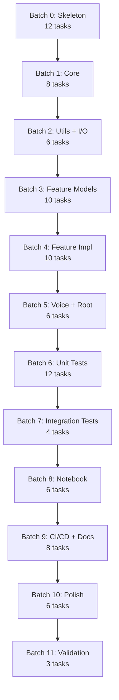

# SoundLab Build Task List

**Optimization Target:** Massively parallel Claude Code subagents  
**Batch Strategy:** Maximize parallelism within each iteration; minimize cross-batch dependencies  
**Task Granularity:** Single file or tightly-coupled file pair per task  

---

## Execution Protocol

```
For each batch:
  1. Spawn N subagents (one per task)
  2. Each agent receives: task ID, task spec, relevant PRD section, dependency outputs
  3. Agents execute independently and commit to feature branches
  4. Barrier sync: wait for all batch tasks to complete
  5. Merge all feature branches → main
  6. Proceed to next batch
```

---

## Batch 0: Repository Skeleton (12 tasks, fully parallel)

All tasks in this batch have **zero dependencies** and create foundational files.

| ID | Task | Output Files | Spec |
|----|------|--------------|------|
| `B0.01` | Create root pyproject.toml | `pyproject.toml` | Workspace config with `[tool.uv.workspace]`, dev-dependencies, ruff/pytest/coverage config per PRD §3 |
| `B0.02` | Create package pyproject.toml | `packages/soundlab/pyproject.toml` | Package metadata, dependencies, optional-dependencies `[voice,notebook,all]`, build-system per PRD §3 |
| `B0.03` | Create .python-version | `.python-version` | Content: `3.12` |
| `B0.04` | Create README.md | `README.md` | Project overview, installation (`uv sync`), quick start code example, badges placeholders |
| `B0.05` | Create LICENSE | `LICENSE` | MIT license with current year, author: Wyatt Walsh |
| `B0.06` | Create CHANGELOG.md | `CHANGELOG.md` | Keep-a-changelog format, `## [Unreleased]` section, `## [0.1.0]` placeholder |
| `B0.07` | Create CONTRIBUTING.md | `CONTRIBUTING.md` | Dev setup with uv, PR guidelines, commit conventions, test requirements |
| `B0.08` | Create .gitignore | `.gitignore` | Python, uv, Jupyter, IDE, OS patterns; include `.venv/`, `__pycache__/`, `*.egg-info/`, `.coverage`, `dist/` |
| `B0.09` | Create directory structure | All `__init__.py` files | Create empty `__init__.py` in: `packages/soundlab/src/soundlab/`, and all submodules: `core/`, `separation/`, `transcription/`, `effects/`, `analysis/`, `voice/`, `io/`, `utils/` |
| `B0.10` | Create py.typed markers | `packages/soundlab/py.typed`, `packages/soundlab/src/soundlab/py.typed` | Empty PEP 561 marker files |
| `B0.11` | Create test directory structure | `tests/conftest.py`, `tests/unit/__init__.py`, `tests/integration/__init__.py` | Empty conftest with TODO comment, empty init files |
| `B0.12` | Create notebooks directory | `notebooks/.gitkeep`, `notebooks/examples/.gitkeep` | Placeholder files for notebook directories |

**Barrier: All B0 tasks must complete before B1**

---

## Batch 1: Core Module (8 tasks, fully parallel)

Dependencies: B0 complete (directory structure exists)

| ID | Task | Output Files | Spec |
|----|------|--------------|------|
| `B1.01` | Create exceptions module | `packages/soundlab/src/soundlab/core/exceptions.py` | Full exception hierarchy per PRD §4.1: `SoundLabError`, `AudioLoadError`, `AudioFormatError`, `ModelNotFoundError`, `GPUMemoryError`, `ProcessingError`, `ConfigurationError`, `VoiceConversionError` |
| `B1.02` | Create types module | `packages/soundlab/src/soundlab/core/types.py` | Type aliases: `AudioArray = NDArray[np.float32]`, `SampleRate = int`, `PathLike = str \| Path`; Protocols: `ProgressCallback`, `AudioProcessor` |
| `B1.03` | Create audio models | `packages/soundlab/src/soundlab/core/audio.py` | `AudioFormat`, `SampleRate`, `BitDepth` enums; `AudioMetadata`, `AudioSegment` Pydantic models per PRD §4.2 |
| `B1.04` | Create config module | `packages/soundlab/src/soundlab/core/config.py` | `SoundLabConfig` singleton with env var loading: `SOUNDLAB_LOG_LEVEL`, `SOUNDLAB_GPU_MODE`, `SOUNDLAB_CACHE_DIR`, `SOUNDLAB_OUTPUT_DIR` |
| `B1.05` | Create core __init__ | `packages/soundlab/src/soundlab/core/__init__.py` | Public exports: all exceptions, `AudioSegment`, `AudioMetadata`, `AudioFormat`, `SoundLabConfig` |
| `B1.06` | Create GPU utilities | `packages/soundlab/src/soundlab/utils/gpu.py` | `get_device(mode: str) -> str`, `get_free_vram_gb() -> float`, `clear_gpu_cache()`, `is_cuda_available() -> bool` |
| `B1.07` | Create logging utilities | `packages/soundlab/src/soundlab/utils/logging.py` | `configure_logging(level: str, log_file: Path \| None)` using loguru; format with timestamp, level, module |
| `B1.08` | Create retry utilities | `packages/soundlab/src/soundlab/utils/retry.py` | Tenacity decorators: `io_retry`, `gpu_retry`, `network_retry` with configs per PRD §10.2 |

**Barrier: All B1 tasks must complete before B2**

---

## Batch 2: Utility Completion + I/O Module (6 tasks, fully parallel)

Dependencies: B1 complete (core types, exceptions available)

| ID | Task | Output Files | Spec |
|----|------|--------------|------|
| `B2.01` | Create progress utilities | `packages/soundlab/src/soundlab/utils/progress.py` | `ProgressCallback` protocol impl, `TqdmProgressCallback`, `GradioProgressCallback` adapters |
| `B2.02` | Create utils __init__ | `packages/soundlab/src/soundlab/utils/__init__.py` | Public exports: `get_device`, `configure_logging`, `io_retry`, `gpu_retry`, `TqdmProgressCallback` |
| `B2.03` | Create audio I/O | `packages/soundlab/src/soundlab/io/audio_io.py` | `load_audio(path) -> AudioSegment`, `save_audio(segment, path, format)`, `get_audio_metadata(path) -> AudioMetadata`; use soundfile + pydub fallback |
| `B2.04` | Create MIDI I/O | `packages/soundlab/src/soundlab/io/midi_io.py` | `load_midi(path) -> MIDIData`, `save_midi(data, path)`, `MIDIData` model with notes, tempo, time_signature |
| `B2.05` | Create export utilities | `packages/soundlab/src/soundlab/io/export.py` | `export_audio(segment, path, format, normalize_lufs)`, `create_zip(files, output_path)`, `batch_export(segments, output_dir)` |
| `B2.06` | Create io __init__ | `packages/soundlab/src/soundlab/io/__init__.py` | Public exports: `load_audio`, `save_audio`, `get_audio_metadata`, `load_midi`, `save_midi`, `export_audio` |

**Barrier: All B2 tasks must complete before B3**

---

## Batch 3: Feature Modules - Models Only (10 tasks, fully parallel)

Dependencies: B2 complete (core + utils + io available)  
Strategy: Create all Pydantic models first, then implementations

| ID | Task | Output Files | Spec |
|----|------|--------------|------|
| `B3.01` | Create separation models | `packages/soundlab/src/soundlab/separation/models.py` | `DemucsModel` enum, `SeparationConfig`, `StemResult` per PRD §4.3 |
| `B3.02` | Create transcription models | `packages/soundlab/src/soundlab/transcription/models.py` | `TranscriptionConfig(onset_thresh, frame_thresh, min_note_length, min_freq, max_freq)`, `NoteEvent(start, end, pitch, velocity)`, `MIDIResult(notes, path, config, processing_time)` |
| `B3.03` | Create effects models | `packages/soundlab/src/soundlab/effects/models.py` | Base `EffectConfig` with `to_plugin() -> Plugin` abstract; `CompressorConfig`, `LimiterConfig`, `GateConfig`, `ReverbConfig`, `DelayConfig`, `ChorusConfig`, `DistortionConfig`, `PhaserConfig`, `HighpassConfig`, `LowpassConfig`, `GainConfig` |
| `B3.04` | Create analysis models | `packages/soundlab/src/soundlab/analysis/models.py` | `TempoResult(bpm, confidence, beats)`, `KeyDetectionResult` per PRD §4.4, `LoudnessResult(lufs, dynamic_range, peak)`, `SpectralResult(centroid, bandwidth, rolloff)`, `AnalysisResult` composite |
| `B3.05` | Create voice models | `packages/soundlab/src/soundlab/voice/models.py` | `TTSConfig(text, language, speaker_wav, temperature, speed)`, `TTSResult(audio_path, processing_time)`, `SVCConfig(pitch_shift, f0_method, index_rate, protect_rate)`, `SVCResult(audio_path, processing_time)` |
| `B3.06` | Create separation utils | `packages/soundlab/src/soundlab/separation/utils.py` | `calculate_segments(duration, segment_length, overlap) -> list[tuple[float, float]]`, `overlap_add(segments, overlap) -> AudioArray` |
| `B3.07` | Create transcription viz | `packages/soundlab/src/soundlab/transcription/visualization.py` | `render_piano_roll(notes, output_path, figsize, colormap)` using matplotlib |
| `B3.08` | Create analysis tempo | `packages/soundlab/src/soundlab/analysis/tempo.py` | `detect_tempo(y, sr) -> TempoResult` using librosa.beat.beat_track |
| `B3.09` | Create analysis loudness | `packages/soundlab/src/soundlab/analysis/loudness.py` | `measure_loudness(y, sr) -> LoudnessResult` using pyloudnorm |
| `B3.10` | Create analysis spectral | `packages/soundlab/src/soundlab/analysis/spectral.py` | `analyze_spectral(y, sr) -> SpectralResult` using librosa spectral features |

**Barrier: All B3 tasks must complete before B4**

---

## Batch 4: Feature Modules - Implementations (10 tasks, fully parallel)

Dependencies: B3 complete (all models available)

| ID | Task | Output Files | Spec |
|----|------|--------------|------|
| `B4.01` | Create Demucs wrapper | `packages/soundlab/src/soundlab/separation/demucs.py` | `StemSeparator` class per PRD §4.3 with lazy model loading, memory checking, retry logic, segment processing |
| `B4.02` | Create separation __init__ | `packages/soundlab/src/soundlab/separation/__init__.py` | Public exports: `StemSeparator`, `SeparationConfig`, `DemucsModel`, `StemResult` |
| `B4.03` | Create Basic Pitch wrapper | `packages/soundlab/src/soundlab/transcription/basic_pitch.py` | `MIDITranscriber` class with `transcribe(audio_path, output_dir) -> MIDIResult`; use correct API: `onset_thresh`, `frame_thresh` |
| `B4.04` | Create transcription __init__ | `packages/soundlab/src/soundlab/transcription/__init__.py` | Public exports: `MIDITranscriber`, `TranscriptionConfig`, `MIDIResult`, `render_piano_roll` |
| `B4.05` | Create key detection | `packages/soundlab/src/soundlab/analysis/key.py` | Full K-K algorithm implementation per PRD §4.4 with `MusicalKey`, `Mode` enums, `detect_key()` function |
| `B4.06` | Create onset detection | `packages/soundlab/src/soundlab/analysis/onsets.py` | `detect_onsets(y, sr) -> OnsetResult` with timestamps, count, strength |
| `B4.07` | Create analysis __init__ | `packages/soundlab/src/soundlab/analysis/__init__.py` | Public exports + `analyze_audio(path) -> AnalysisResult` convenience function that runs all analyzers |
| `B4.08` | Create effects chain | `packages/soundlab/src/soundlab/effects/chain.py` | `EffectsChain` class per PRD §4.5 with fluent API, process_array, process file |
| `B4.09` | Create effects implementations | `packages/soundlab/src/soundlab/effects/dynamics.py`, `effects/eq.py`, `effects/time_based.py`, `effects/creative.py` | Implement `to_plugin()` for all effect configs; map to Pedalboard plugins |
| `B4.10` | Create effects __init__ | `packages/soundlab/src/soundlab/effects/__init__.py` | Public exports: `EffectsChain`, all config classes |

**Barrier: All B4 tasks must complete before B5**

---

## Batch 5: Voice Module + Package Root (6 tasks, fully parallel)

Dependencies: B4 complete (all feature modules available)

| ID | Task | Output Files | Spec |
|----|------|--------------|------|
| `B5.01` | Create TTS wrapper | `packages/soundlab/src/soundlab/voice/tts.py` | `TTSGenerator` class wrapping coqui-tts XTTS-v2; `generate(config) -> TTSResult`; handle model download |
| `B5.02` | Create SVC wrapper | `packages/soundlab/src/soundlab/voice/svc.py` | `VoiceConverter` class for RVC; `convert(audio_path, model_path, config) -> SVCResult`; document manual setup requirements |
| `B5.03` | Create voice __init__ | `packages/soundlab/src/soundlab/voice/__init__.py` | Public exports: `TTSGenerator`, `TTSConfig`, `VoiceConverter`, `SVCConfig` |
| `B5.04` | Create package version | `packages/soundlab/src/soundlab/_version.py` | `__version__ = "0.1.0"`, `__version_info__ = (0, 1, 0)` |
| `B5.05` | Create package __init__ | `packages/soundlab/src/soundlab/__init__.py` | Public API exports from all modules; `__version__` import; `__all__` list |
| `B5.06` | Create CLI entry point | `packages/soundlab/src/soundlab/cli.py` | Typer CLI with subcommands: `separate`, `transcribe`, `analyze`, `effects`, `tts`; `--help` for each |

**Barrier: All B5 tasks must complete before B6**

---

## Batch 6: Unit Tests (12 tasks, fully parallel)

Dependencies: B5 complete (package fully implemented)

| ID | Task | Output Files | Spec |
|----|------|--------------|------|
| `B6.01` | Create test fixtures | `tests/conftest.py` | pytest fixtures: `sample_audio_path`, `sample_mono_audio`, `sample_stereo_audio`, `temp_output_dir`, `mock_gpu_available` |
| `B6.02` | Create test audio files | `tests/fixtures/audio/sine_440hz_3s.wav`, `tests/fixtures/audio/silence_1s.wav` | Generate programmatically in conftest or include small test files |
| `B6.03` | Test core exceptions | `tests/unit/test_exceptions.py` | Test exception hierarchy, inheritance, string representation |
| `B6.04` | Test core audio models | `tests/unit/test_audio_models.py` | Test `AudioSegment`, `AudioMetadata` validation, properties, conversions |
| `B6.05` | Test utils gpu | `tests/unit/test_gpu.py` | Test `get_device()` with mocked torch, `is_cuda_available()` |
| `B6.06` | Test utils logging | `tests/unit/test_logging.py` | Test `configure_logging()` sets correct levels, handlers |
| `B6.07` | Test io audio | `tests/unit/test_audio_io.py` | Test `load_audio()`, `save_audio()` roundtrip, format detection, error handling |
| `B6.08` | Test separation models | `tests/unit/test_separation_models.py` | Test `DemucsModel` enum properties, `SeparationConfig` validation, defaults |
| `B6.09` | Test transcription models | `tests/unit/test_transcription_models.py` | Test `TranscriptionConfig` bounds validation, `NoteEvent` ordering |
| `B6.10` | Test effects models | `tests/unit/test_effects_models.py` | Test all effect configs validate parameters, `to_plugin()` returns correct types |
| `B6.11` | Test analysis key | `tests/unit/test_key_detection.py` | Test K-K algorithm with known key audio samples, Camelot conversion |
| `B6.12` | Test effects chain | `tests/unit/test_effects_chain.py` | Test `EffectsChain` fluent API, empty chain passthrough, multi-effect processing |

**Barrier: All B6 tasks must complete before B7**

---

## Batch 7: Integration Tests (4 tasks, fully parallel)

Dependencies: B6 complete (unit tests validate components)

| ID | Task | Output Files | Spec |
|----|------|--------------|------|
| `B7.01` | Test separation integration | `tests/integration/test_separation_integration.py` | End-to-end test: load audio → separate → verify stems exist; mark `@pytest.mark.slow` |
| `B7.02` | Test transcription integration | `tests/integration/test_transcription_integration.py` | End-to-end: load audio → transcribe → verify MIDI output; mark `@pytest.mark.slow` |
| `B7.03` | Test analysis integration | `tests/integration/test_analysis_integration.py` | End-to-end: `analyze_audio()` returns valid `AnalysisResult` with all fields |
| `B7.04` | Test pipeline integration | `tests/integration/test_pipeline.py` | Full pipeline: upload → separate → analyze → effects → export; verify zip contents |

**Barrier: All B7 tasks must complete before B8**

---

## Batch 8: Notebook Implementation (6 tasks, fully parallel)

Dependencies: B7 complete (package tested and working)

| ID | Task | Output Files | Spec |
|----|------|--------------|------|
| `B8.01` | Create notebook header cells | `notebooks/soundlab_studio.ipynb` (cells 1-3) | Markdown header, environment setup Form cell, package installation Form cell per PRD §5.3 |
| `B8.02` | Create upload interface cell | `notebooks/soundlab_studio.ipynb` (cell 4) | Gradio upload interface with `gr.Audio`, metadata display per PRD §5.3 |
| `B8.03` | Create separation cell | `notebooks/soundlab_studio.ipynb` (cell 5) | Colab Forms config + execution code calling `soundlab.separation` |
| `B8.04` | Create transcription cell | `notebooks/soundlab_studio.ipynb` (cell 6) | Colab Forms config + execution + piano roll Gradio display |
| `B8.05` | Create analysis + effects cells | `notebooks/soundlab_studio.ipynb` (cells 7-8) | Analysis Form/execution, Effects chain Form/execution with A/B preview |
| `B8.06` | Create voice + export cells | `notebooks/soundlab_studio.ipynb` (cells 9-11) | Voice generation Form, Export Gradio interface, Cleanup cell |

**Barrier: All B8 tasks must complete before B9**

---

## Batch 9: CI/CD + Documentation (8 tasks, fully parallel)

Dependencies: B8 complete (notebook implemented)

| ID | Task | Output Files | Spec |
|----|------|--------------|------|
| `B9.01` | Create CI workflow | `.github/workflows/ci.yml` | lint, typecheck, test jobs per PRD §8.1 |
| `B9.02` | Create release workflow | `.github/workflows/release.yml` | Build + PyPI publish on tag per PRD §8.2 |
| `B9.03` | Create Colab test workflow | `.github/workflows/colab-test.yml` | Weekly scheduled test of notebook imports |
| `B9.04` | Create pre-commit config | `.pre-commit-config.yaml` | Hooks: ruff, ruff-format, check-yaml, end-of-file-fixer, trailing-whitespace |
| `B9.05` | Create mkdocs config | `docs/mkdocs.yml` | mkdocs-material theme, nav structure, mkdocstrings plugin config |
| `B9.06` | Create quickstart guide | `docs/guides/quickstart.md` | Installation, basic usage examples for each module |
| `B9.07` | Create Colab usage guide | `docs/guides/colab-usage.md` | Step-by-step Colab notebook usage with screenshots placeholders |
| `B9.08` | Create extending guide | `docs/guides/extending.md` | How to add new effects, analyzers, voice models |

**Barrier: All B9 tasks must complete before B10**

---

## Batch 10: Polish + Examples (6 tasks, fully parallel)

Dependencies: B9 complete (CI + docs in place)

| ID | Task | Output Files | Spec |
|----|------|--------------|------|
| `B10.01` | Create example notebook: stems | `notebooks/examples/stem_separation.ipynb` | Focused example: load song → htdemucs_ft → save stems → compare A/B |
| `B10.02` | Create example notebook: MIDI | `notebooks/examples/midi_transcription.ipynb` | Focused example: piano recording → Basic Pitch → MIDI → piano roll |
| `B10.03` | Create example notebook: voice | `notebooks/examples/voice_conversion.ipynb` | Focused example: TTS generation + RVC conversion demo |
| `B10.04` | Create model download script | `scripts/download_models.py` | CLI to pre-download Demucs, XTTS models to cache |
| `B10.05` | Create benchmark script | `scripts/benchmark.py` | Benchmark all modules on reference audio, output markdown table |
| `B10.06` | Update README with badges | `README.md` | Add CI status, PyPI version, coverage, license badges; update examples with tested code |

---

## Batch 11: Final Validation (3 tasks, sequential)

Dependencies: B10 complete  
**Note:** These run sequentially for final validation

| ID | Task | Output Files | Spec |
|----|------|--------------|------|
| `B11.01` | Run full test suite | - | `uv run pytest tests/ -v --cov=soundlab`; ensure >80% coverage |
| `B11.02` | Build and test package | - | `uv build --package soundlab`; test install in fresh venv |
| `B11.03` | Validate Colab notebook | - | Open in Colab, run all cells, verify no errors |

---

## Summary Statistics

| Metric | Value |
|--------|-------|
| Total Batches | 12 |
| Total Tasks | 91 |
| Max Parallel Tasks (single batch) | 12 |
| Estimated Total Agent-Hours | ~45-60 |
| Estimated Wall-Clock (with parallelism) | ~8-12 hours |

---

## Dependency Graph (Mermaid)



---

## Agent Dispatch Template

```json
{
  "task_id": "B3.05",
  "batch": 3,
  "title": "Create voice models",
  "output_files": [
    "packages/soundlab/src/soundlab/voice/models.py"
  ],
  "dependencies": ["B1.01", "B1.03", "B2.06"],
  "context_files": [
    "packages/soundlab/src/soundlab/core/exceptions.py",
    "packages/soundlab/src/soundlab/core/audio.py"
  ],
  "prd_sections": ["§7.5"],
  "spec": "Create Pydantic models: TTSConfig(text, language, speaker_wav, temperature, speed), TTSResult(audio_path, processing_time), SVCConfig(pitch_shift, f0_method, index_rate, protect_rate), SVCResult(audio_path, processing_time). Include field validators, docstrings, __all__ exports.",
  "acceptance_criteria": [
    "All models inherit from pydantic.BaseModel",
    "All fields have type hints",
    "Validators enforce parameter ranges per PRD §7.5",
    "Module has __all__ list",
    "No import errors when loaded standalone"
  ]
}
```

---

## Execution Commands

```bash
# Initialize workspace
uv init soundlab-workspace
cd soundlab-workspace

# After B0: Lock dependencies
uv lock

# After each batch: Run available tests
uv run pytest tests/ -v -x --tb=short

# After B5: Verify package imports
uv run python -c "import soundlab; print(soundlab.__version__)"

# After B9: Run full CI locally
uv run ruff check .
uv run ruff format --check .
uv run ty check packages/soundlab/src
uv run pytest tests/ -v --cov=soundlab

# Final: Build distributable
uv build --package soundlab
```
